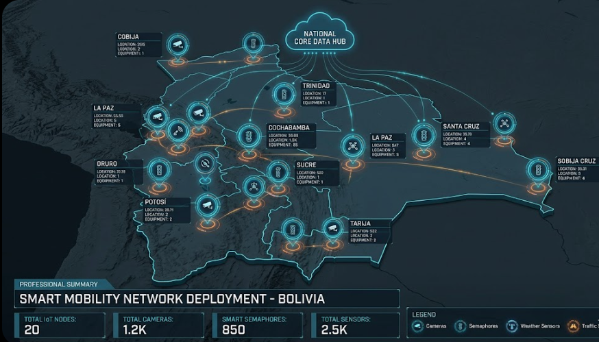

# NexaTraffic: National Smart Grid & Traffic Monitoring System

  
  

  
  
  
  
  
  

## Visión General

NexaTraffic es una plataforma de monitoreo de tráfico nacional de alto rendimiento diseñada para la gestión inteligente de movilidad urbana. El sistema integra telemetría de 200 ubicaciones remotas, procesando un promedio de 4 millones de eventos vehiculares diarios mediante una arquitectura distribuida basada en eventos (Event-Driven Architecture).

La solución garantiza escalabilidad elástica, tolerancia a fallos y procesamiento en tiempo real para la detección de infracciones, seguimiento de trayectorias y análisis climático.

## Vista Preliminar del Dashboard (Mockup)

A continuación se muestran dos capturas del dashboard administrativo en desarrollo. La primera presenta una visión general del sistema con indicadores clave y mapa de calor; la segunda ilustra la sección de monitoreo de infracciones en tiempo real.

  
  

*Estas imágenes son representativas del estado actual del prototipo y se irán refinando durante la implementación final.*

## Documentación de Arquitectura

Seleccione una sección para explorar los detalles técnicos del sistema.

### 01 Contexto y Requisitos
- [Visión General](documentation.nexa/01_Contexto_Y_Requisitos/01_Vision_General.md) – Contexto estratégico y propósitos.
- [Alcance Detallado](documentation.nexa/01_Contexto_Y_Requisitos/02_Alcance_Detallado.md) – Funcionalidades, límites y supuestos.
- [Glosario Técnico](documentation.nexa/01_Contexto_Y_Requisitos/03_Glosario_Tecnico.md) – Definiciones de dominio y terminología.
- [Propuesta Inicial y Brechas](documentation.nexa/01_Contexto_Y_Requisitos/04_Propuesta_Inicial.md) – Análisis de incertidumbres y mitigaciones.

### 02 Análisis de Dominio (DDD)
- [Event Storming](documentation.nexa/02_Analisis_Dominio_DDD/01_Event_Storming.md) – Línea de tiempo de eventos de negocio.
- [Bounded Contexts](documentation.nexa/02_Analisis_Dominio_DDD/02_Bounded_Contexts.md) – Descomposición del sistema en contextos delimitados.
- [Context Map](documentation.nexa/02_Analisis_Dominio_DDD/03_Context_Map.md) – Relaciones y protocolos entre contextos.
- [Modelo de Dominio](documentation.nexa/02_Analisis_Dominio_DDD/04_Domain_Model.md) – Entidades, agregados, value objects y eventos.
- [Casos de Uso de Dominio](documentation.nexa/02_Analisis_Dominio_DDD/05_Domain_Use_Cases.md) – Flujos críticos con JSON canónicos.

### 03 Diseño Arquitectónico
- [Justificación Cloud-Native](documentation.nexa/03_Diseño_Arquitectonico/01_Justificacion_Estilo_Cloud_Native.md) – Microservicios vs monolito, EDA, 12 factores.
- [C4 Nivel 1: Contexto](documentation.nexa/03_Diseño_Arquitectonico/02_Vista_C4_L1_Contexto.md) – Interacciones externas (PlantUML).
- [C4 Nivel 2: Contenedores](documentation.nexa/03_Diseño_Arquitectonico/03_Vista_C4_L2_Contenedores.md) – Infraestructura distribuida (PlantUML).
- [C4 Nivel 3: Componentes](documentation.nexa/03_Diseño_Arquitectonico/04_Vista_C4_L3_Componentes.md) – Lógica interna de servicios (PlantUML).
- [Diagramas de Secuencia Kafka](documentation.nexa/03_Diseño_Arquitectonico/05_Diagramas_Secuencia_Kafka_Flows.md) – Flujos asíncronos.
- [Persistencia Políglota](documentation.nexa/03_Diseño_Arquitectonico/06_Estrategia_Persistencia_Poliglota.md) – Estrategia de almacenamiento.
- [Resiliencia y Back-pressure](documentation.nexa/03_Diseño_Arquitectonico/07_Estrategia_Resiliencia_Backpressure.md) – Tolerancia a fallos y control de flujo.

### 04 Decisiones Tecnológicas
- [Stack Tecnológico](documentation.nexa/04_Decisiones_Tecnologicas/01_Stack_Tecnologico_Propuesto.md) – Lenguajes, frameworks, infraestructura y costos.
- [Escalabilidad Elástica](documentation.nexa/04_Decisiones_Tecnologicas/02_Estrategia_Escalabilidad_Elastic.md) – Políticas de autoescalado y KEDA.
- [Trade-offs y Disponibilidad](documentation.nexa/04_Decisiones_Tecnologicas/03_Analisis_Trade_offs_Disponibilidad.md) – Análisis CAP, HA, degradación controlada.

### 05 Gestión y Operación
- [Matriz de Riesgos](documentation.nexa/05_Gestion_Y_Operacion/01_Matriz_de_Riesgos_Arquitectonicos.md) – Identificación y mitigación de riesgos.
- [Cronograma de Implementación](documentation.nexa/05_Gestion_Y_Operacion/02_Cronograma_Implementacion_Fases.md) – 7 semanas + demo.
- [Validación POC](documentation.nexa/05_Gestion_Y_Operacion/03_Validacion_POC_Ingesta_Masiva.md) – Pruebas de carga simuladas.
- [CI/CD y Reflexión IA](documentation.nexa/05_Gestion_Y_Operacion/04_CI_CD_y_Reflexion_IA.md) – Pipeline GitHub Actions y uso de inteligencia artificial.

### Conclusiones Finales
- [Conclusiones y Reflexión](documentation.nexa/07_Conclusiones.md) – Resumen, trade-offs asumidos, limitaciones y lecciones aprendidas.

---

## Atributos de Calidad Principales

| Atributo | Métrica Objetivo | Estrategia |
|----------|------------------|------------|
| **Rendimiento** | Latencia < 200ms | Procesamiento en memoria con Redis y Go. |
| **Escalabilidad** | 15,400+ Usuarios | Orquestación con Kubernetes y Auto-scaling. |
| **Disponibilidad** | 99.99% | Arquitectura multi-región y aislamiento de fallos. |

## Stack Tecnológico

- **Backend:** Java Spring Boot (servicios transaccionales) y Go (ingesta de alto rendimiento).
- **Messaging:** Apache Kafka (Event Streaming backbone).
- **Persistencia:** PostgreSQL (datos relacionales), ClickHouse (analítica masiva), Redis (caché).
- **Infraestructura:** Docker, Kubernetes, Helm.
- **Analítica:** Python (modelado de datos de tráfico).

---

**Autor:** Ever Mamani Vicente  
**Proyecto:** Capstone - Arquitectura de Software 4  
**Institución:** Universidad Jala  
**Fecha:** Abril 2026
