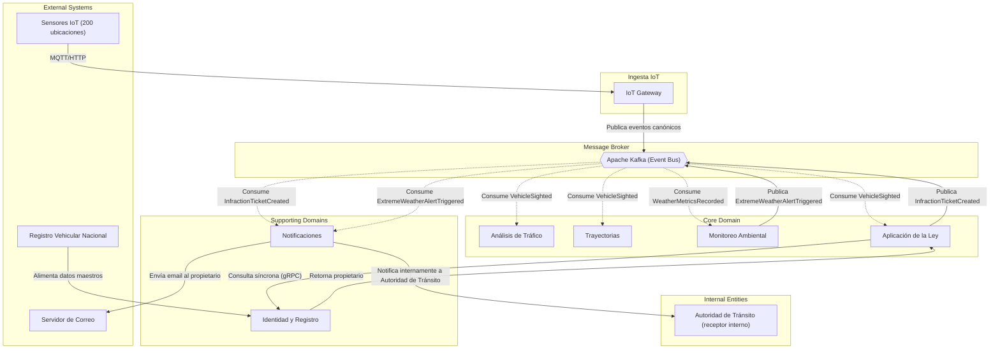

# Context Map: Relaciones entre Contextos Delimitados

## 1. Propósito

Este documento define cómo se comunican los diferentes bounded contexts de NexaTraffic. Se utiliza una topología orientada a eventos (Pub/Sub) como patrón dominante, complementada con relaciones síncronas puntuales y capas anticorrupción.

## 2. Diagrama de Contextos (Mermaid)

## 3. Descripción de las Relaciones

| Relación | Tipo | Descripción |
|----------|------|-------------|
| `Ingesta IoT → Kafka` | **Publicación (Pub)** | El gateway normaliza y publica eventos crudos sin esperar respuesta. |
| `Kafka → Análisis, Trayectorias, Ley, Ambiental` | **Suscripción (Sub)** | Cada contexto consume los eventos que le interesan. Desacoplamiento total. |
| `Ley → Identidad` | **Cliente-Servidor síncrono (Customer/Supplier)** | Se consulta el propietario de una placa mediante gRPC con circuit breaker. |
| `Ley → Kafka` | **Publicación** | Después de crear una multa, se publica `InfractionTicketCreated`. |
| `Ambiental → Kafka` | **Publicación** | Alerta climática se publica para que Notificaciones la consuma. |
| `Kafka → Notificaciones` | **Suscripción** | Notificaciones reacciona a multas y alertas climáticas. |
| `Notificaciones → Identidad` | **Lectura de caché (opcional)** | Para obtener email del propietario sin llamada síncrona en cada envío. |
| `Registro Vehicular → Identidad` | **Alimentación por lotes (ACL)** | Los datos maestros se sincronizan periódicamente con una capa anticorrupción. |

## 4. Patrones de Integración Usados

- **Pub/Sub (event-driven)**: Principal medio de comunicación. Kafka como backbone.
- **Anti-Corruption Layer (ACL)**: Dentro de `Ingesta IoT` para aislar formatos propietarios de sensores; dentro de `Identidad` para sincronizar con el registro vehicular externo.
- **Customer/Supplier**: Entre `Law Enforcement` (cliente) e `Identity & Registry` (proveedor) en la consulta síncrona.
- **Shared Kernel** (no usado): No se comparte código entre contextos para evitar acoplamiento.
- **Separate Ways** (no usado): No hay contextos completamente aislados sin comunicación.

## 5. Nota sobre la Evolución

El mapa de contexto permite agregar nuevos consumidores de eventos sin modificar los productores. La relación síncrona entre `Law Enforcement` e `Identity & Registry` es el único punto de acoplamiento débil; se debe monitorear su latencia y disponibilidad.
