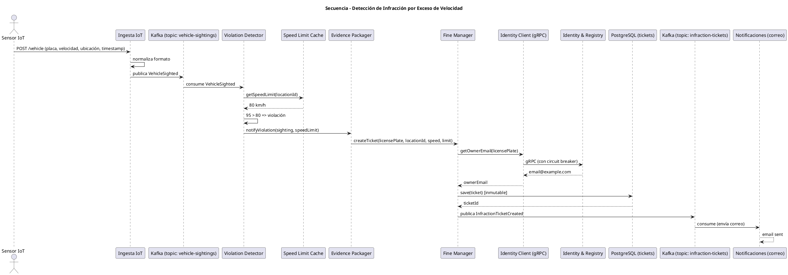
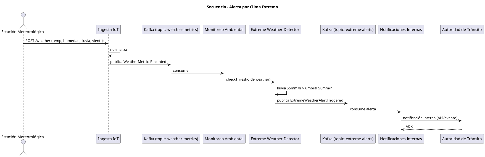

# Diagramas de Secuencia: Flujos Asíncronos con Kafka

## 1. Descripción

Los diagramas de secuencia muestran la interacción temporal entre componentes a través del bus de eventos (Kafka). Se presentan dos flujos críticos:

- **Flujo de ingesta y detección de infracción** (con foto opcional).
- **Flujo de alerta climática extrema**.

## 2. Flujo de detección de infracción (PlantUML)



## 3. Explicación del flujo

- El sensor envía un avistamiento **sin foto** (solo placa, velocidad, ubicación, timestamp).
- Ingesta normaliza y publica `VehicleSighted` en Kafka.
- `Violation Detector` consume y evalúa contra el límite en caché.
- Si hay violación, se activa `Evidence Packager`, luego `Fine Manager`.
- `Fine Manager` consulta el registro vehicular (síncrono) para obtener el correo.
- Se persiste el ticket inmutable en PostgreSQL.
- Se publica `InfractionTicketCreated` a Kafka.
- Notificaciones consume y envía el correo al propietario.

## 4. Flujo de alerta climática extrema (PlantUML)



## 5. Explicación del flujo de alerta

- La estación meteorológica envía datos cada 5 minutos.
- `Monitoreo Ambiental` consume `WeatherMetricsRecorded`.
- `Extreme Weather Detector` evalúa los umbrales (por ejemplo, lluvia > 50 mm/h).
- Si se supera, se publica `ExtremeWeatherAlertTriggered`.
- `Notificaciones` consume la alerta y la envía a la **Autoridad de Tránsito** (sistema interno, no redes sociales).

## 6. Notas sobre asincronía y resiliencia

- **Productores**: Ingesta, Law Enforcement, Ambiental.
- **Consumidores**: Todos los microservicios (cada uno con su grupo de consumidores).
- **Garantías**:
  - Kafka con `acks=all` y replicación (factor 3) evita pérdida de eventos.
  - Idempotencia en consumidores mediante tabla de `processed_event_ids` (evita duplicados).
  - Dead Letter Queue (DLQ) para eventos que fallan después de reintentos.
- **Back-pressure**: Ingesta aplica HTTP 503 si el productor de Kafka no puede enviar (buffer lleno). Los sensores deben reintentar con backoff.

## 7. Ejemplo de IDs de eventos

Cada evento incluye un `eventId` único (UUID v7) generado en el productor. Los consumidores verifican idempotencia almacenando estos IDs (con TTL) en Redis.

```json
{
  "eventId": "0195f8e2-1234-7a3b-9cde-426614174000",
  "eventType": "VehicleSighted",
  ...
}
```
