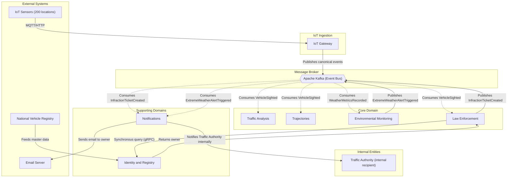

# Context Map: Relationships Between Bounded Contexts

## 1. Purpose

This document defines how the different bounded contexts of NexaTraffic communicate. An event-oriented topology (Pub/Sub) is used as the dominant pattern, complemented by specific synchronous relationships and anti-corruption layers.

## 2. Context Diagram (Mermaid)

## 3. Relationship Descriptions

| Relationship | Type | Description |
|----------|------|-------------|
| `IoT Ingestion → Kafka` | **Publication (Pub)** | The gateway normalizes and publishes raw events without waiting for a response. |
| `Kafka → Analysis, Trajectories, Law, Environmental` | **Subscription (Sub)** | Each context consumes the events it is interested in. Complete decoupling. |
| `Law → Identity` | **Synchronous Client-Server (Customer/Supplier)** | The owner of a license plate is queried via gRPC with a circuit breaker. |
| `Law → Kafka` | **Publication** | After creating a fine, `InfractionTicketCreated` is published. |
| `Environmental → Kafka` | **Publication** | A weather alert is published for Notifications to consume. |
| `Kafka → Notifications` | **Subscription** | Notifications reacts to fines and weather alerts. |
| `Notifications → Identity` | **Cache Read (optional)** | To get the owner's email without a synchronous call for each send. |
| `Vehicle Registry → Identity` | **Batch Feed (ACL)** | Master data is synchronized periodically via an anti-corruption layer. |

## 4. Integration Patterns Used

- **Pub/Sub (event-driven)**: Primary means of communication. Kafka as the backbone.
- **Anti-Corruption Layer (ACL)**: Within `IoT Ingestion` to isolate proprietary sensor formats; within `Identity` to synchronize with the external vehicle registry.
- **Customer/Supplier**: Between `Law Enforcement` (customer) and `Identity & Registry` (supplier) in the synchronous query.
- **Shared Kernel** (not used): No code is shared between contexts to avoid coupling.
- **Separate Ways** (not used): There are no completely isolated contexts without communication.

## 5. Note on Evolution

The context map allows adding new event consumers without modifying the producers. The synchronous relationship between `Law Enforcement` and `Identity & Registry` is the only weak coupling point; its latency and availability must be monitored.
