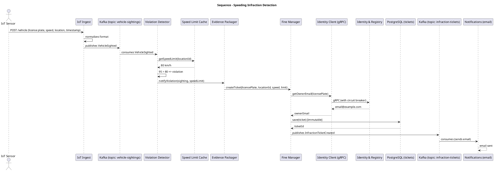
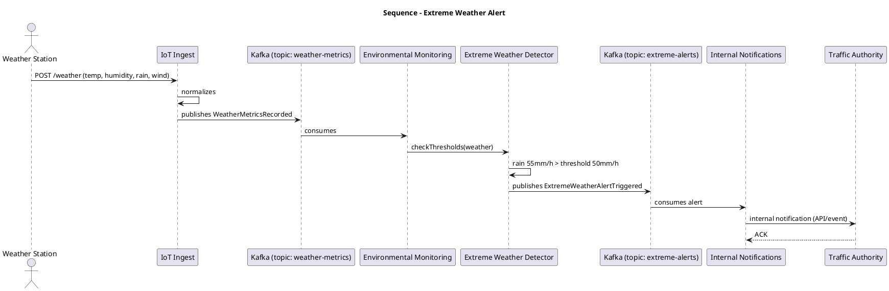

# Sequence Diagrams: Asynchronous Flows with Kafka

## 1. Description

Sequence diagrams show the temporal interaction between components via the event bus (Kafka). Two critical flows are presented:

- **Infraction ingestion and detection flow** (with optional photo).
- **Extreme weather alert flow**.

## 2. Infraction Detection Flow (PlantUML)



## 3. Flow Explanation

- The sensor sends a sighting **without a photo** (only license plate, speed, location, timestamp).
- Ingest normalizes and publishes `VehicleSighted` to Kafka.
- `Violation Detector` consumes and evaluates against the cached limit.
- If there is a violation, `Evidence Packager` is activated, then `Fine Manager`.
- `Fine Manager` queries the vehicle registry (synchronously) to obtain the email.
- The immutable ticket is persisted in PostgreSQL.
- `InfractionTicketCreated` is published to Kafka.
- Notifications consumes and sends the email to the owner.

## 4. Extreme Weather Alert Flow (PlantUML)



## 5. Alert Flow Explanation

- The weather station sends data every 5 minutes.
- `Environmental Monitoring` consumes `WeatherMetricsRecorded`.
- `Extreme Weather Detector` evaluates thresholds (e.g., rain > 50 mm/h).
- If exceeded, `ExtremeWeatherAlertTriggered` is published.
- `Notifications` consumes the alert and sends it to the **Traffic Authority** (internal system, not social media).

## 6. Notes on Asynchronicity and Resilience

- **Producers**: Ingest, Law Enforcement, Environmental.
- **Consumers**: All microservices (each with its own consumer group).
- **Guarantees**:
  - Kafka with `acks=all` and replication (factor 3) prevents event loss.
  - Idempotency in consumers via `processed_event_ids` table (prevents duplicates).
  - Dead Letter Queue (DLQ) for events that fail after retries.
- **Back-pressure**: Ingest applies HTTP 503 if the Kafka producer cannot send (buffer full). Sensors must retry with backoff.

## 7. Event ID Example

Each event includes a unique `eventId` (UUID v7) generated by the producer. Consumers verify idempotency by storing these IDs (with TTL) in Redis.

```json
{
  "eventId": "0195f8e2-1234-7a3b-9cde-426614174000",
  "eventType": "VehicleSighted",
  ...
}
```
